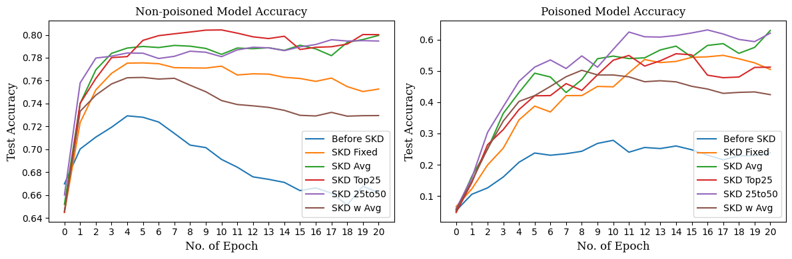

# Adaptive Semi-supervised Federated Learning with Selective Knowledge Distillation

This work builds on the work of [FedMD](https://arxiv.org/abs/1910.03581)

### Hypothesis 01 : Introducing poisonous nodes in the federated network can have negative impact on collaborative learning

#### Experiemnt: Introduce varying number of poisoned node in all four environments of FedMD an observe the impact on collaborative learning.

#### Results:

FEMNIST Balanced:

FEMNIST Imbalanced:

CIFAR Balanced:

CIFAR Imbalanced:

### Hypothesis 02 : Selective Knowledge Distillation (SKD) can minimize the impact of poisoned nodes in collaborative learning

Framework:

#### Experiemnt: We test SKD algorithm on all four environements with 40% nodes poisoned

#### Results:

FEMNIST Balanced:

FEMNIST Imbalanced:

CIFAR Balanced:

CIFAR Imbalanced:

### Hypothesis 03 : Selective Knowledge Distillation (SKD) will also work on semi-supervised setting

Semi-supervised learning methodology:

#### Experiemnt: We test SKD algorithm on all four environements with 40% nodes poisoned

#### Results:

FEMNIST Balanced:

FEMNIST Imbalanced:

CIFAR Balanced:

CIFAR Imbalanced:

